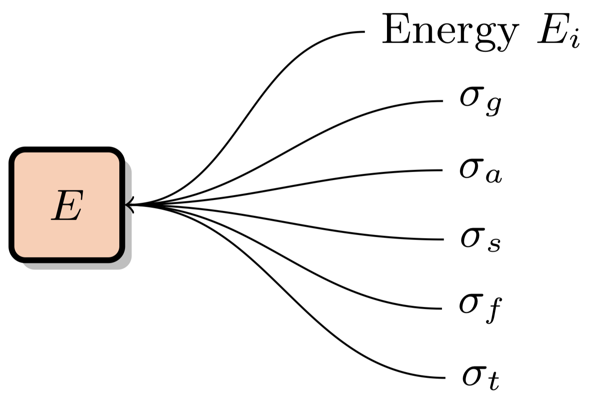
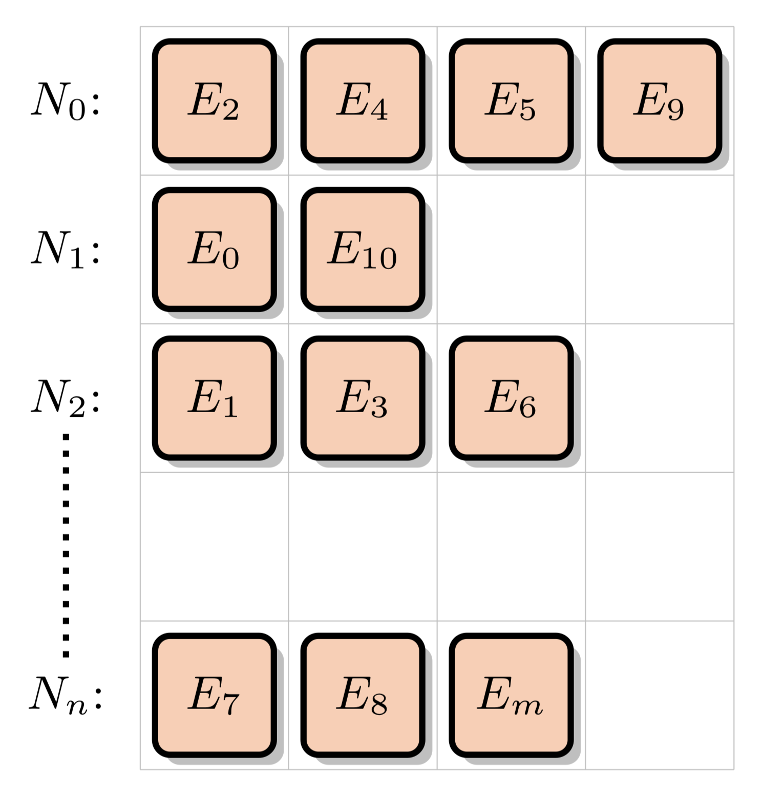
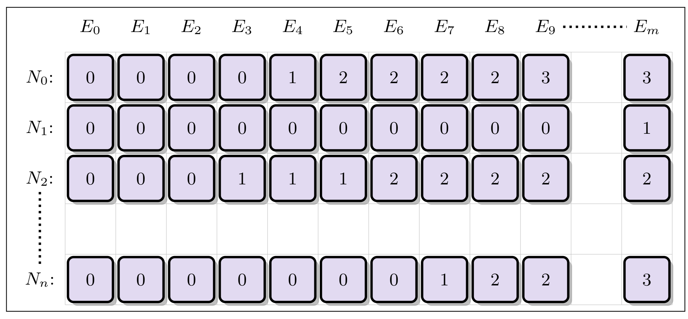

[](https://github.com/ANL-CESAR/XSBench/releases/latest)
[](https://travis-ci.com/ANL-CESAR/XSBench)
[](https://www.sciencedirect.com/science/article/pii/S0306454914004332)

XSBench is a mini-app representing a key computational kernel of the Monte Carlo neutron transport algorithm. Specifically, XSBench represents the continuous energy macroscopic neutron cross section lookup kernel. XSBench serves as a lightweight stand-in for full neutron transport applications like [OpenMC](https://github.com/openmc-dev/openmc), and is a useful tool for performance analysis on high performance computing architectures.

## Table of Contents

1. [Selecting a Programming Model](#selecting-a-programming-model)
2. [Compilation](#Compilation)
3. [Running XSBench / Command Line Interface](#Running-XSBench)
4. [Feature Discussion](#Feature-Discussion)
	* [MPI Support](#MPI-Support)
	* [Verification Support](#Verification-Support)
	* [Binary File Support](#Binary-File-Support)
5. [Theory & Algorithms](#Algorithms)
	* [Transport Simulation Styles](#Transport-Simulation-Styles)
		- [History-Based Transport](#History-Based-Transport)
		- [Event-Based Transport](#Event-Based-Transport)
	* [Cross Section Lookup Methods](#Cross-Section-Lookup-Methods)
		- [Nuclide Grid](#Nuclide-Grid)
		- [Unionized Energy Grid](#Unionized-Energy-Grid)
		- [Logarithmic Hash Grid](#Logarithmic-Hash-Grid)
6. [Optimized Kernels](#Optimized-Kernels)
7. [Citing XSBench](#Citing-XSBench)
8. [Development Team](#Development-Team) 

## Selecting A Programming Model

XSBench has been implemented in multiple different languages to target a variety of computational architectures and accelerators. The available implementations can be found in their own directories:

1. **XSBench/openmp-threading**
This is the "default" version of XSBench that is appropriate for serial and multicore CPU architectures. The method of parallelism is via the OpenMP threading model.

2. **XSBench/openmp-offload**
This method of parallelism uses OpenMP 4.5 (or newer) to map program data to a remote accelerator memory space and run targeted kernels on the accelerator. This method of parallelism could be used for a wide variety of architectures (besides CPUs) that support OpenMP 4.5 targeting. NOTE: The Makefile will likely not work by default and will need to be adjusted to utilize your OpenMP accelerator compiler.

3. **XSBench/cuda**
This version of XSBench is written in CUDA for use with NVIDIA GPU architectures. NOTE: You will likely want to specify in the makefile the SM version for the card you are running on.

4. **XSBench/opencl**
This version of XSBench is written in OpenCL, and can be used for CPU, GPU, FPGA, or other architectures that support OpenCL. It was written with GPUs in mind, so if running on other architectures you may need to heavily re-optimize the code. You will also likely need to edit the makefile to supply the path to your OpenCL compiler.

4. **XSBench/sycl**
This version of XSBench is written in SYCL, and can be used for CPU, GPU, FPGA, or other architectures that support OpenCL and SYCL. It was written with GPUs in mind, so if running on other architectures you may need to heavily re-optimize the code. You will also likely need to edit the makefile to supply the path to your SYCL compiler.

## Compilation

To compile XSBench with default settings, navigate to your selected source directory and use the following command:

```bash
make
```
 
 You can alter compiler settings in the included Makefile. Alternatively, for the OpenMP threading version of XSBench you may specify a compiler via the CC environment variable and then making as normal, e.g.:
```bash
export CC=clang
make
```

### Debugging, Optimization & Profiling

There are also a number of switches that can be set in the makefile. Here is a sample of the control panel at the top of the makefile:

```make
OPTIMIZE = yes
DEBUG    = no
PROFILE  = no
MPI      = no
```
- Optimization enables the -O3 optimization flag.
- Debugging enables the -g flag.
- Profiling enables the -pg flag. When profiling the code, you may
wish to significantly increase the number of lookups (with the -l
flag) in order to wash out the initialization phase of the code.
- MPI enables MPI support in the code.

## Running XSBench

To run XSBench with default settings, use the following command:
```bash
./XSBench
```
For non-default settings, XSBench supports the following command line options:

| Argument    |Description | Options     | Default
|-------------|------------|---------------|------------|
|-t           |# of OpenMP threads| integer value | System Default|
|-m           |Simulation method| history, event| history|
|-s | Problem Size | small, large, XL, XXL | large|
|-g | # of gridpoints per nuclide (overrides -s defaults) | integer value| 11,303 |
-G | Grid search type | unionized, nuclide, hash | unionized |
-p | # of particle histories (if running using "history" method)| integer value | 500,000 |
-l | # of Cross-section (XS) lookups. If using using history based method, this is lookups per particle history. If using event-based method, this is total lookups. | integer value | (History: 34) (Event: 17,000,000) |
-h | # of hash bins (only used with hash-based grid search) | integer value | 10,000 |
-b | Read/Write binary files | read, write |  |
-k | Optimized kernel ID | integer value | 0

- **-t [threads]**
Sets the number of OpenMP threads to run. By default, XSBench will run with 1 thread per hardware core. If the architecture supports hyperthreading, multiple threads will be run per core. If running in MPI mode, this will be the number of threads per MPI rank. This argument is only used by the OpenMP threading version of XSBench.

- **-m [simulation method]**
Sets the simulation method, either "history" or "event". These options represent the history based or event based algorithms respectively. The default is the history based method. These two methods represent different methods of parallelizing the Monte Carlo transport method. In the history based method, the central mode of parallelism is expressed over particles, which each require some number of macroscopic cross sections to be executed in series and in a dependent order. The event based method expresses its parallelism over a large pool of independent macroscopic cross section lookups that can be executed in any order without dependence. They key difference between the two methods is the dependence/independence of the macroscopic cross section loop. See the [Transport Simulation Styles](#Transport-Simulation-Styles) section for more information.

- **-s [size]**
Sets the size of the Hoogenboom-Martin reactor model. There are four options: 'small', 'large', 'XL', and 'XXL'. By default, the 'large' option is selected. The H-M size corresponds to the number of nuclides present in the fuel region. The small version has 34 fuel nuclides, whereas the large version has 321 fuel nuclides. This significantly slows down the runtime of the program as the data structures are much larger, and more lookups are required whenever a lookup occurs in a fuel material. Note that the program defaults to "Large" if no specification is made. The additional size options, "XL" and "XXL", do not directly correspond to any particular physical model. They are similar to the H-M "large" option, except the number of gridpoints per nuclide has been increased greatly. This creates an extremely large energy grid data structure (XL: 120GB, XXL: 252GB), which is unlikely to fit on a single node, but is useful for experimentation purposes on novel architectures.

- **-g [gridpoints]**
Sets the number of gridpoints per nuclide. By default, this value is set to 11,303. This corresponds to the average number of actual gridpoints per nuclide in the H-M Large model as run by OpenMC with the actual ACE ENDF cross-section data. Note that this option will override the number of default gridpoints as set by the '-s' option.

- **-G [grid type]**
Sets the grid search type (unionized, nuclide, hash). Defaults to unionized. The unionized grid is what is typically used in Monte Carlo codes, as it offers the fastest speed. However, the increase in speed comes in a significant increase in memory usage as a union of all the separate nuclide grids must be formed and stored in memory. The "nuclide" mode uses only the basic nuclide grid data, with no unionization. This is slower as a binary search must be performed on every nuclide for each macroscopic XS lookup, rather than only once when using the unionized grid. Finally, the "hash" mode is a newer algorithm now used by many full Monte Carlo codes which offers speed nearly equivalent to the unionized energy grid method, but with only a small fraction of the memory overhead. See the [Cross Section Lookup Methods](#Cross-Section-Lookup-Methods) section for more details.

- **-p [particles]**
Sets the number of particle histories to simulate. By default, this value is set to 500,000. Users may want to increase this value if they wish to extend the runtime of XSBench, perhaps to produce more reliable performance counter data - as extending the run will decrease the percentage of runtime spent on initialization. Real MC simulations in a full application may use up to several billion particles per generation, so there is great flexibility in this variable.

- **-l [lookups]**
Sets the number of cross-section (XS) lookups to perform per particle. By default, this value is set to 34, which represents the average number of XS lookups per particle over the course of its lifetime in a light water reactor problem. Users should only alter this value if they are trying to capture the behavior of a different type of reactor (e.g., one with a fast spectrum), where the number of lookups per history may be different.

- **-h [hash bins]**
Sets the number of hash bins (only relevant when using the hash lookup algorithm, as selected with "-G hash"). Default is 10,000.

- **-b [binary mode]**
This optional mode can read or write the simulation data structures to disk. Options are ("read" or "write"). This may be useful if it is necessary to minimize the initialization phase of the program, which has a non-trivial runtime. The generated file is named "XS_data.dat" and will be located in the current working directory. The same file name and location will be used when reading. Note that as the file is binary, it may not be portable between compilers and computer systems. NOTE: When running in the "read" mode, you must be running with an identical program configuration as when the file was generated. E.g., if the file was generated with the "-G nuclide" argument, subsequent runs reading from that file must use the same configuration flags.

- **-k [kernel]**
For some of the XSBench code-bases (e.g., openmp-threading and cuda) there are several optimized variants of the main kernel. All source bases run basically the same "baseline" kernel as default. Optimized kernels can be selected at runtime with this argument. Default is "0" for the baseline, other variants are numbered 1, 2, ... etc. People interested in implementing their own optimized variants are encouraged to use this interface for convenience rather than writing over the main kernel. The baseline kernel is defined at the top of the "Simulation.c" source file, with the other variants being defined towards the end of the file after a large comment block delineation. The optimized variants are related to different ways of sorting the sampled values such that there is less thread divergence and much better cache re-usage when executing the lookup kernel on contiguous sorted elements. More details can be found in the [Optimized Kernels](#Optimized-Kernels) section.

## Feature Discussion

### MPI Support

While XSBench is primarily used to investigate "on node parallelism" issues, some systems provide power & performance statistics batched in multi-node configurations. To accommodate this, XSBench provides an MPI mode which runs the code on all MPI ranks simultaneously. There is no decomposition across ranks of any kind, and all ranks accomplish the same work. This is a "weak scaling" approach -- for instance, if running the event-based model all MPI ranks will execute 17,000,000 cross section lookups regardless of how many ranks are used. There is only one point of MPI communication (a reduce) at the end, which aggregates the timing statistics and averages them across MPI ranks before printing them out. MPI support can be enabled with the makefile flag "MPI". If you are not using the mpicc wrapper on your system, you may need to alter the makefile to make use of your desired compiler.

### Verification Support

Legacy versions of XSBench had a special "Verification" compiler flag option to enable verification of the results. However, a much more performant and portable verification scheme was developed and is now used for all configurations -- therefore, it is not necessary to compile with or without the verification mode as it is always enabled by default. XSBench generates a hash of the results at the end of the simulation and displays it with the other data once the code has completed executing. This hash can then be verified against hashes that other versions or configurations of the code generate. For instance, running XSBench with 4 threads vs 8 threads (on a machine that supports that configuration) should generate the same hash number. Running on GPU vs CPU should not change the hash number. However, changing the model / run parameters is expected to generate a totally different hash number (i.e., increasing the number of particles, number of gridpoints, etc, will result in different hashes). However, changing the type of lookup performed (e.g., nuclide, unionized, or hash) should result in the same hash being generated. Changing the simulation mode (history or event) will generate different hashes.

### Binary File Support

Instead of initializing the randomized synthetic cross section data structres in XSBench everytime it is run, you may optionally have XSBench generate a data set and write it to file. It can then be read on subsequent runs to speed up initialization. This process is controlled with the "-b (read, write)" command line argument. This feature may be extremely useful for users running on simulators where walltime minimization is critical for logistical purposes, or for users who are doing many sequential runs. Note that identical input parameters (problem size, solution method etc) must be used when reading and writing a binary file. No runtime checks are made to validate that the file correctly corresponds to the selected input parameters.


## Algorithms

### Transport Simulation Styles

#### History-Based Transport

The default simulation model used in XSBench is the "history-based" model. In this model, parallelism is expressed over independent particle histories, with each particle being simulated in a serial fashion from birth to death: 

```c
for each particle do		   // Independent
	while particle is alive do // Dependent
		Move particle to collision site
		Process particle collision
```

This method of parallelism is very memory efficient, as the total number of particles that must be kept in memory at once is equivalent to the total number of active threads being run in the simulation. However, as there are many different types of collision events, the history-based model means that there is no natural SIMD style parallelism available for work happening between different threads.

#### Event-Based Transport

An alternative simulation model is the "event-based" model. In this model, parallelism is instead expressed over different collision (or "event") types. To facilitate this, all particles in the simulation are stored in memory at once. Each event kernel is executed in parallel on vectors of particles that currently require that event to be executed:

```c
Get vector of source particles
while any particles are alive do	     // Dependent
	for each living particle do          // Independent
		Move particle to collision site
	for each living particle do          // Independent
		Process particle collision
	Sort/consolidate surviving particles
```
This method of parallelism is requires more memory and requires an extra stream compaction kernel to sort and organize the particles periodically to ready them for the different event kernels. The benefit of this model is that kernels can potentially be execute in a SIMD manner and with higher cache efficiency due to the potential to sort particles by material and energy. On CPU architectures, the costs of sorting and buffering particles typically outweigh the benefits of the event-based model, but on accelerator architectures the tradeoff has been found to usually be more favorable.

### Cross Section (XS) Lookup Methods

XSBench represents the macroscopic cross section lookup kernel. This kernel is responsible for adding together microscopic cross section data from all nuclides present in the material the neutron is travelling through, given a certain energy:

<p align="center">  </p>

Macroscopic cross section data is typically required for multiple reaction channels "c", such as the total cross section, fission cross section, etc. This data is typically stored in point-wise data form for each nuclide. There are multiple ways of accessesing this data in an efficient manner which will be discusses in this section.

#### Nuclide Grid

This is the default "naive" method of performing macroscopic XS lookups. XS data is stored for a number of energy levels for each nuclide in the simulation problem. Different nuclides can have a different number of energy levels. For instance, U-238 usually has over 100k energy levels, whereas some other nuclides may only have a few thousand. The "Nuclide Grid" is composed of all nuclides in the problem, with a variable number of data points for each nuclide. Each data point is composed of the energy level and accompanying cross section data for multiple different reaction channels:

<p align="center">  </p>

These XS data points are arranged into the nuclide grid:

<p align="center">  </p>

When assembling a macroscopic cross section data point, we will be accessing and interpolating data from the nuclide grid for a neutron travelling through a given material (composed of some number of nuclides) and at a given energy level. This will involve performing a binary search for each nuclide:

```
Nuclide_Grid_Search( Energy E, Material M ):
	macroscopic XS = 0
	for each nuclide in M do:
		index = binary search to find E in nuclide grid
		interpolate data from grid[nuclide, index]
		macroscopic XS += data
```

This algorithm requires no extra memory usage beyond the minimum to represent the pointwise cross section data, but also requires that a binary search be run for each nuclide in the material the neutron is travelling through. In the case of depleted fuel, there can be 300+ nuclides, making this option computationally expensive.

#### Unionized Energy Grid

One way of speeding up the nuclide grid search is to form a separate acceleration structure to reduce the number of binary searches that need to be performed. In the Unionized Energy Grid (EUG) method, a second grid is created with columns corresponding to the **union** of all energy levels from the nuclide grid. For each energy level (column) in the unionized grid, each row stores an index corresponding to the closest location in the nuclide grid for each nuclide corresponding that energy level:

<p align="center">  </p>

A lookup using the UEG therefore requires only one single binary search on the unionized grid, allowing then for fast accesses using the indices stored at that energy level:

```
Unionized_Grid_Search( Energy E, Material M ):
	macroscopic XS = 0
	UEG_index = binary search to find E in unionized grid
	for each nuclide in M do:
		index = unionized_grid[nuclide, UEG_index]
		interpolate data from grid[nuclide, index]
		macroscopic XS += data
```

#### Logarithmic Hash Grid

An alternative to the unionized energy grid is the logarithmic hash grid. This method takes in account the fact that while nuclides will be tabulated on grids containing different numbers of energy points, the points within each nuclide's grid will in general be spaced in (roughly) uniform maner in log space . Therefore, the nuclide grid is augmented with a separate acceleration structure similar to the unionized grid. However, the number of columns is capped at some number of bins spaced evenly in log space, with each row therefore corresponding to an approximate location within each nuclide's grid for that energy level. While the unionized grid points exactly to the correct index in the nuclide grid, the logarithmic hash grid points to only an approximate location below the true point -- meaning that a fast binary or iterative search must still be performed over the constrained area (typically only 10 or so elements in size):

```
Logarithmic_Hash_Grid_Search( Energy E, Material M ):
	macroscopic XS = 0
	hash_index = grid_delta * (ln(E) - grid_minimum_energy)
	for each nuclide in M do:
		i_low  = unionized_grid[nuclide, hash_index]
		i_high = unionized_grid[nuclide, hash_index+1]
		index = binary search in range(i_low, i_high) to find E in nuclide grid
		interpolate data from grid[nuclide, index]
		macroscopic XS += data
```

Compared to the unionized energy grid method, the logarithmic hash method uses far less memory but typically results in competitive performance. More details on this method can be found in the following publication:
   
>Forrest B Brown. New hash-based energy lookup algorithm for monte carlo codes. Trans. Am. Nucl. Soc., 111:659–662, 2014. http://permalink.lanl.gov/object/tr?what=info:lanl-repo/lareport/LA-UR-14-27037


## Optimized Kernels

If using the event-based model, we will be executing the lookup kernel in XSBench across all particles at once. While SIMD execution is possible using this method, typically issues can arrise that greatly reduce SIMD efficiency. In particular, different materials in the simulation have very different numbers of nuclides in them. For instance, spent fuel has 300+ nuclides, while moderator regions only have 10 or so nuclides. This creates a significant load imbalance across lanes in a SIMD vector, as some particles may only need a few iterations to complete all nuclides while others would need hundreds. Furthermore, due to the random memory accesses involved in the binary search process, efficient SIMD execution of the event-based model is not possible without some optimizations.

One promising optimization for the event-based model is to perform a key-value sort of particles: first by material, and then by energy within each material. The first sort by material allows for adjacent particles in the vector to typically reside in the same type of material -- meaning that they will require the same number of nuclide lookup iterations. Then, the energy sort means that adjacent particles in the vector will be located close in energy space -- potentially allowing for many adjacent particles to access the same energy indices in each nuclide and therefore perform many or all of the same branching operations and read the same cache lines into memory at the same time. Once sorted, separate event kernels are then called for each material in the simulation. These two sorts can potentially boost both SIMD efficieny and cache efficiency, with effects being amplified as more particles are simulated at each event stage. The downside to this optimization is the introduction of the key-value particle sorting operations, which can be costly and potentially outweight any gains due to improved SIMD efficiency and cache performance.

We have implemented this optimization in both the OpenMP threading and CUDA models. They are not enabled by default, but must be enabled with the "-k 1" or "-k 6" flags if running with OpenMP and CUDA respectively. These optimizations have not yet been implemented in the other programming models due to the lack of an efficient parallel sorting function being easily available without having to create an external library dependency.

## Citing XSBench

Papers citing the XSBench program in general should refer to:

>J. R. Tramm, A. R. Siegel, T. Islam, and M. Schulz, “XSBench - The Development and Verification of a Performance Abstraction for Monte Carlo Reactor Analysis,” presented at PHYSOR 2014 - The Role of Reactor Physics toward a Sustainable Future, Kyoto. https://www.mcs.anl.gov/papers/P5064-0114.pdf

Bibtex Entry:

```bibtex
@inproceedings{Tramm:wy,
author = {Tramm, John R and Siegel, Andrew R and Islam, Tanzima and Schulz, Martin},
title = {{XSBench} - The Development and Verification of a Performance Abstraction for {M}onte {C}arlo Reactor Analysis},
booktitle = {{PHYSOR} 2014 - The Role of Reactor Physics toward a Sustainable Future},
address = {Kyoto},
year = 2014,
url = "https://www.mcs.anl.gov/papers/P5064-0114.pdf"
}
```

## Development Team
Authored and maintained by John Tramm ([@jtramm](https://github.com/jtramm)) with help from Ron Rahaman, Amanda Lund, and other [contributors](https://github.com/ANL-CESAR/XSBench/graphs/contributors).
